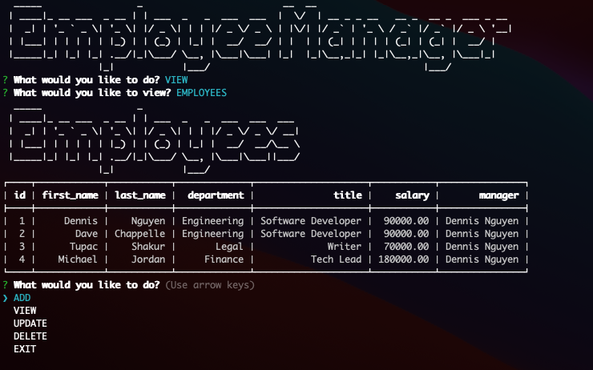

# Employee Manager!
  
  
  ## Description 
 Application called Employee Manager that can be used to view and store departments, roles, and employees in a company.
  
  ## Table of contents
  - [Description](#description)
  - [Installation](#installation)
  - [Usage](#usage)
  - [License](#license)
  - [My Process](#my-process)
  - [Repository Link](#repository)
  - [Questions](#questions)
  
  
  
  
  ## Installation
  This app was developed and tested using MySQL. Please refer to: [MySQL documentation](https://dev.mysql.com/doc/mysql-installation-excerpt/5.7/en/)
    
    - Clone the repo
    - npm i
    - run schema.sql and seeds.sql create database and tables
        
  ## Usage
    GIVEN a command-line application that accepts user input
    WHEN I start the application
    THEN I am presented with the following options: view all departments, view all roles, view all employees, add a department, add a role, add an employee, and update an employee role
    WHEN I choose to view all departments
    THEN I am presented with a formatted table showing department names and department ids
    WHEN I choose to view all roles
    THEN I am presented with the job title, role id, the department that role belongs to, and the salary for that role
    WHEN I choose to view all employees
    THEN I am presented with a formatted table showing employee data, including employee ids, first names, last names, job titles, departments, salaries, and managers that the employees report to
    WHEN I choose to add a department
    THEN I am prompted to enter the name of the department and that department is added to the database
    WHEN I choose to add a role
    THEN I am prompted to enter the name, salary, and department for the role and that role is added to the database
    WHEN I choose to add an employee
    THEN I am prompted to enter the employee’s first name, last name, role, and manager, and that employee is added to the database
    WHEN I choose to update an employee role
    THEN I am prompted to select an employee to update and their new role and this information is updated in the database
      
  ## License
  MIT License: https://choosealicense.com/licenses/mit/
  ## My Process
  ### Built With
  - MySQL
  - Javascript
  - Inquirer
  
  This application is a command-line CMS (content management systems) interface that will allow users to easily view and interact with information stored in a database. 
  
  ## Repository
  - [Video Walkthrough](https://drive.google.com/file/d/1Jexbb787WGiX6rUnHKf58kBJwkRUZaRF/view?usp=sharing)
  - [Project Repo](https://github.com/dnsnguy08/employee_tracker)
  ## Questions
  For any questions, please reach out to:
  - Dennis Nguyen
  - [GitHub Profile](https://github.com/dnsnguy08)
